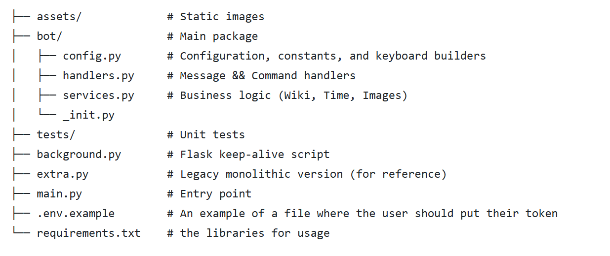

# ⚙️ Python Telegram Bot
<br>
<b>A multi-functional Telegram bot, originally created at high school, refactored applying Software Engineering methodologies -- modular design, unit testing.</b>

This project was built in two phases.

**Phase 1:**

The content of the bot: articles, videos, photos, and functionality. Used to be a 🧱 monolithic code, a refined version is available in extra.py and a server script in background.py

* *Wikipedia Search:* gives a meaning of the word, a short summary, from Wikipedia using Wikipedia package.
* *Educational Resources:* Quick menus for Python libraries (Telebot, Tkinter, Turtle, Pillow) -- those that were used inside the bot.
* *Time & Date:* Real-time New York timezone conversion with datetime.
* *Media Handling:* Random images generated by Midjourney and sticker handling.
* *Keep-Alive Service:* Includes a Flask background process to keep the bot running, e.g. on Replit. Can be found in background.py

**Phase 2:**

An evolution from a hobby project to engineering mindset. (The rest of the project: see below)

* *Architecture:* Modular architecture (Service Layer pattern)
*  *Config:* Environment variables (`.env`) & Dynamic paths
*  *Logic:* Business logic isolated in `services.py`
*  *Quality:* Unit testing via `pytest`

## Project Structure:

<p align="center">
  
</p>

## How to install and why to install:

This project can be used as an example project for telegram bot building not via website-builders. I would recommend clonning
the repo and using it for your own purposes.

## Installation steps:

You can use any shell, the steps are in BASH:

**0. Clone the repository**
```bash
git clone (https://github.com/yourusername/telegram-bot-revised.git)
cd telegram-bot-revised
```
**1. Set up Virtual Environment**
```bash
python -m venv venv
source venv/bin/activate  # On Windows: venv\Scripts\activate
```
**2. Install all the necessary libraries**
```bash
pip install -r requirements.txt
```
**3. Environment Variables**
Create a `.env` file in the root directory:
```ini
TELEGRAM_TOKEN=your_token_here
 ```
**4. Run the Bot**
```bash
python main.py
```
**5. Use pytest in the terminal for testing**
```bash
pytest
```

# END!🎆


